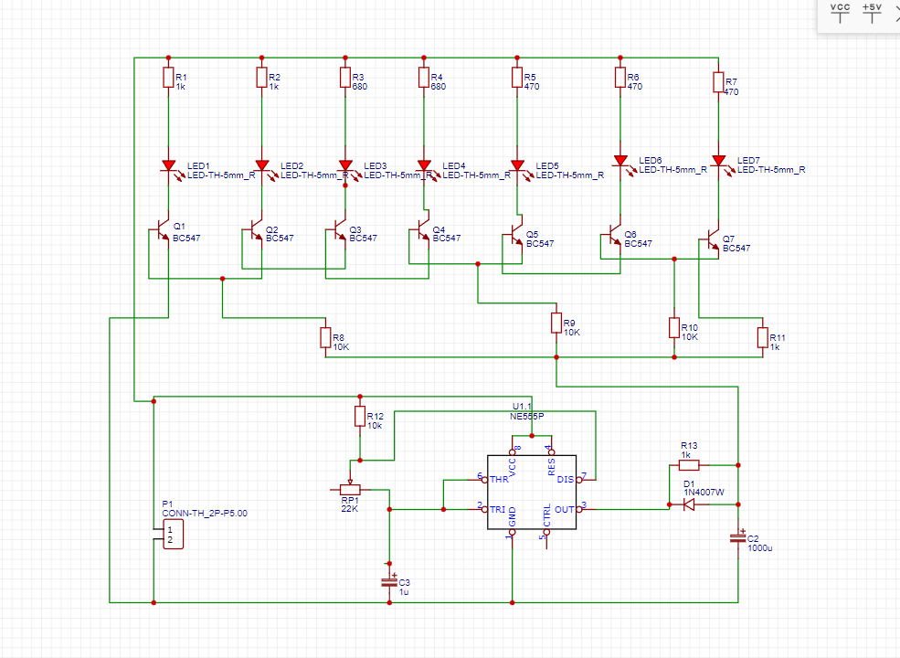
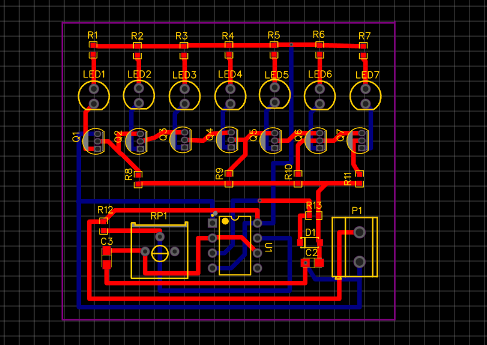
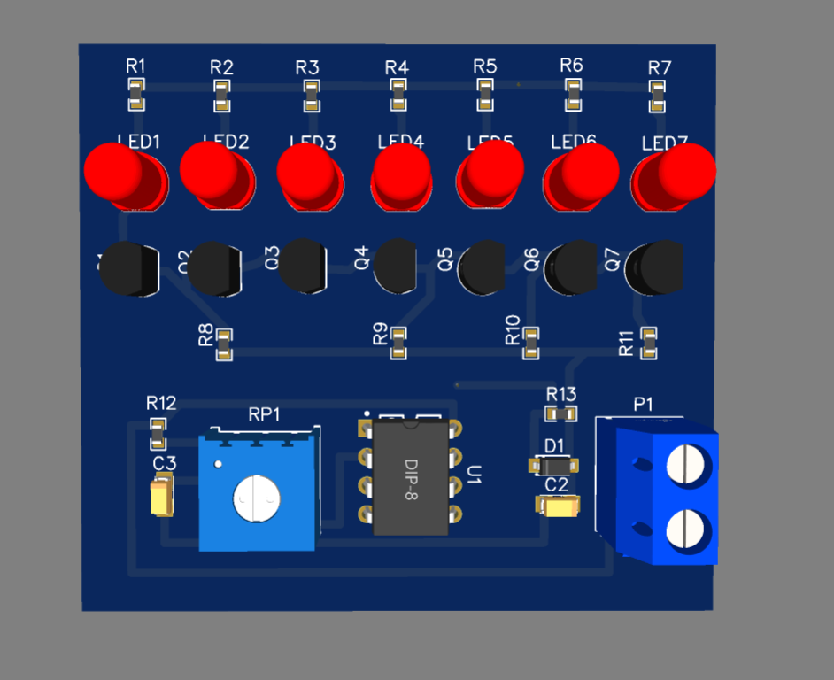
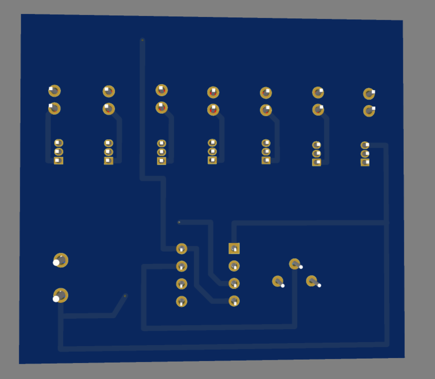

# 💡 LED Flasher PCB Design using NE555 Timer

> A compact and beginner-friendly PCB project designed using the **NE555 Timer IC** and **BC547 Transistors** to create a sequential LED flasher circuit. Designed in **EasyEDA** and prepared for PCB fabrication.

---

# 📷 Project Preview

## 🔹 Circuit Schematic

---

## 🔹 PCB Layout

---

## 🔹 3D Top View

---

## 🔹 3D Bottom View

---

# ✨ Project Features

✔ 7 LED Sequential Flasher

✔ Adjustable Flashing Speed

✔ NE555 Timer Based Design

✔ BC547 Transistor LED Driver Stage

✔ Compact Two-Layer PCB

✔ EasyEDA Design

✔ Manufacturing Ready

✔ Beginner-Friendly Electronics Project

---

# ⚙ Components Used

| Component | Quantity |
|-----------|---------:|
| NE555 Timer IC | 1 |
| BC547 Transistors | 7 |
| LEDs | 7 |
| Resistors | 13 |
| Capacitors | 2 |
| Diode (1N4007) | 1 |
| Potentiometer | 1 |
| Terminal Block | 1 |

---

# 🔄 Working Principle

The **NE555 Timer IC** is configured in **astable mode**, generating continuous clock pulses.

These pulses drive a network of **BC547 transistors**, causing the LEDs to switch ON sequentially and create a **running/flashing light effect**.

The **potentiometer** allows adjustment of the flashing speed by changing the oscillation frequency of the NE555 timer.

---

# 🛠 Software Used

- EasyEDA
- GitHub

---

# 🎯 Skills Demonstrated

- Electronic Circuit Design
- PCB Schematic Design
- PCB Layout
- Component Placement
- PCB Routing
- Design Rule Check (DRC)
- PCB 3D Visualization
- Hardware Design

---

# 🚀 Future Improvements

- Add Microcontroller Control
- Multiple Flashing Modes
- PWM Brightness Control
- Battery Powered Version
- ESP32 Based LED Controller

---

# 📚 Learning Outcomes

This project helped me improve my understanding of:

- NE555 Timer IC
- Astable Multivibrator
- BC547 Switching Circuit
- PCB Design Workflow
- EasyEDA PCB Design
- PCB Manufacturing Process

---

# 📌 Project Status

🟢 **Completed**

✔ Schematic Design

✔ PCB Layout

✔ DRC Verification

✔ 3D PCB Visualization

✔ Ready for Fabrication

---

# 👨‍💻 Author

## **Azmeera Bannu**

Electronics & Communication Engineering Student

### Areas of Interest

- PCB Design
- Embedded Systems
- ESP32
- IoT
- Hardware Development

🔗 **GitHub:** https://github.com/bannu20

---

# ⭐ Support

If you found this project helpful or interesting,

⭐ **Star this repository**

🍴 **Fork it**

💬 **Share your suggestions**

Your feedback is greatly appreciated!

---

## 🚀 More PCB projects coming soon...
